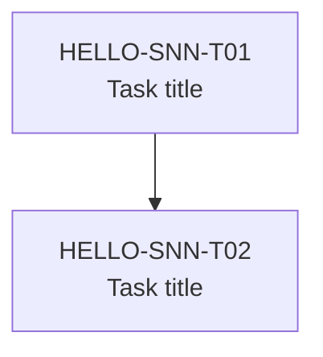

# Sprint Manifest: HELLO-SNN

## Sprint Title
<!-- Short descriptive name for this sprint, e.g. "Add farewell greeting option" -->

## Goals
<!-- What this sprint achieves — 2–4 bullet points -->
- 
- 

## Carry-Over
<!-- Items from previous sprint that roll into this one. Remove section if none. -->
| ID | Title | Reason Carried |
|----|-------|----------------|
| HELLO-S(NN-1)-T01 | | |

## Task Table

| ID | Title | Estimate | Depends On | Status |
|----|-------|----------|------------|--------|
| HELLO-SNN-T01 | | S / M / L | — | planned |
| HELLO-SNN-T02 | | S / M / L | HELLO-SNN-T01 | planned |

**Estimate key:** S = ~30 min, M = ~1 hr, L = ~2+ hrs

## Dependency Graph

## Execution Mode
<!-- Choose one and delete the others -->
sequential
<!-- wave-parallel -->
<!-- full-parallel -->

**Rationale:** <!-- Why this execution mode was chosen -->

## Operational Impact

| Category | Impact |
|----------|--------|
| CLI behaviour | <!-- e.g. new flag added, existing flag modified, output format changed --> |
| Install / packaging | <!-- e.g. new dependency, entry-point change (`pip install -e .`) --> |
| Tests | <!-- e.g. new test cases, no test runner configured --> |
| Configuration | <!-- e.g. new click option, environment variable, config file --> |

## Python / click Specifics

### Entry Point
- Entry point: `hello.py:main`
- Install command: `pip install -e .`

### click Considerations
<!-- Flag definitions, parameter types, command groups affected by this sprint -->
- 

### Testing Notes
<!-- No test runner is configured for this project. Manual verification steps: -->
1. `pip install -e .`
2. `hello <NAME>` — verify baseline behaviour unchanged
3. <!-- Sprint-specific verification steps -->

## Risks
<!-- Known risks. Remove section if none. -->
| Risk | Likelihood | Mitigation |
|------|-----------|------------|
| | low / med / high | |

## Technical Debt
<!-- Planned debt repayment in this sprint. Remove section if none. -->
- 
